# 🛡️ Enterprise SSH Threat Monitoring & Detection Engineering with Splunk

<p align="center">
  
</p>

<p align="center">
  <strong>Cloud-Based SOC Detection Engineering Lab | From Authentication Telemetry to Detection, Alerting & Investigation</strong>
</p>

<p align="center">
  AWS EC2 • Splunk Enterprise • Ubuntu Linux • Kali Linux • SPL • Detection Engineering
</p>

<p align="center">
  
  
  
  
  
  
</p>

---

## 📌 Executive Overview

**Enterprise SSH Threat Monitoring & Detection Engineering with Splunk** is an end-to-end, cloud-hosted Security Operations Center (SOC) lab that demonstrates the complete lifecycle of Linux SSH threat monitoring—from raw authentication telemetry to centralized SIEM analysis, custom detections, dashboards, automated alerting, and analyst investigation.

The environment is deployed using **AWS EC2**, with an Ubuntu Linux system acting as the monitored endpoint and Splunk Enterprise providing centralized security monitoring.

Authentication telemetry generated by the OpenSSH service is recorded in:

```text
/var/log/auth.log
```

The **Splunk Universal Forwarder** continuously monitors the authentication log and forwards security events to Splunk Enterprise over **TCP port 9997**.

The events are stored in a dedicated:

```text
linux_auth
```

index and analyzed using custom **Splunk Search Processing Language (SPL)** detections.

Controlled authentication testing from a Kali Linux system generates representative security telemetry, allowing the complete detection pipeline to be validated.

The project demonstrates the full security monitoring lifecycle:

```text
Attack Simulation
        ↓
Authentication Telemetry
        ↓
Log Collection
        ↓
Centralized SIEM
        ↓
Detection Engineering
        ↓
Dashboard Visualization
        ↓
Automated Alerting
        ↓
SOC Investigation
```

> **Security Notice:** All security testing and attack simulations documented in this repository were performed exclusively within an authorized and controlled lab environment.

---

## ⭐ Project Highlights

| Capability | Implementation |
|---|---|
| ☁️ **Cloud Infrastructure** | AWS EC2, VPC, and Security Groups |
| 📡 **Telemetry Pipeline** | Ubuntu `auth.log` → Splunk Universal Forwarder → Splunk Enterprise |
| 🔎 **Detection Engineering** | Custom SPL detections for failures, source IPs, targeted users, and brute-force behavior |
| 📊 **SOC Visibility** | Operational dashboard for authentication monitoring and investigation |
| 🚨 **Automated Detection** | Scheduled Splunk alerting with validated trigger history |
| 🕵️ **Investigation Workflow** | Alert → Source IP → Targeted Account → Timeline → Authentication Outcome → Triage |

---

## 📑 Table of Contents

- [Project Objectives](#-project-objectives)
- [Architecture](#️-architecture)
- [Architecture Components](#-architecture-components)
- [Data Flow](#-data-flow)
- [Technology Stack](#️-technology-stack)
- [Project Workflow](#-project-workflow)
- [AWS Infrastructure](#️-aws-infrastructure)
- [Splunk Configuration](#-splunk-configuration)
- [Log Collection Pipeline](#-log-collection-pipeline)
- [Attack Simulation](#-attack-simulation)
- [Detection Engineering](#-detection-engineering)
- [Detection Catalog](#-detection-catalog)
- [SOC Dashboard](#-soc-dashboard)
- [Automated Alerting](#-automated-alerting)
- [SOC Investigation Workflow](#️-soc-investigation-workflow)
- [Project Screenshots](#-project-screenshots)
- [Repository Structure](#️-repository-structure)
- [Documentation](#-documentation)
- [Skills Demonstrated](#-skills-demonstrated)
- [Lessons Learned](#-lessons-learned)
- [Version 1.0](#-version-10)
- [Future Roadmap](#️-future-roadmap)
- [Security Considerations](#-security-considerations)
- [License](#-license)
- [Author](#-author)

---

# 🎯 Project Objectives

The primary objective of this project is to demonstrate how a SOC can monitor and investigate credential-based attacks targeting Linux SSH services.

The project was designed to:

- Deploy a centralized SIEM using Splunk Enterprise
- Build cloud-based security monitoring infrastructure in AWS
- Monitor Linux SSH authentication activity
- Collect authentication logs using Splunk Universal Forwarder
- Centralize security telemetry in a dedicated Splunk index
- Simulate controlled SSH authentication activity
- Develop custom SPL detection rules
- Detect repeated authentication failures
- Identify potential SSH brute-force behavior
- Identify attacking source IP addresses
- Identify frequently targeted user accounts
- Monitor successful SSH authentications
- Correlate successful authentication with previous failures
- Build an operational SOC monitoring dashboard
- Configure automated scheduled alerts
- Document the complete attack-to-detection workflow

---

# 🏗️ Architecture

The project implements an end-to-end SSH security monitoring pipeline connecting attack simulation, endpoint telemetry, log forwarding, SIEM analysis, and SOC investigation.

<p align="center">
  
</p>

The architecture follows this workflow:

```text
Kali Linux
    │
    │ Controlled SSH Testing
    │ TCP/22
    ▼
Ubuntu Target Server
    │
    │ /var/log/auth.log
    ▼
Splunk Universal Forwarder
    │
    │ TCP/9997
    ▼
Splunk Enterprise
    │
    ├── linux_auth Index
    ├── SPL Detection Rules
    ├── Dashboards
    └── Scheduled Alerts
    │
    ▼
SOC Analyst
    │
    ├── Monitoring
    ├── Investigation
    └── Incident Response
```

---

# 🧩 Architecture Components

## Kali Linux

Kali Linux represents the controlled security testing system.

It is used to generate authentication activity against the lab environment so that security detections can be tested and validated.

Tools used include:

- Nmap
- Hydra
- SSH client

---

## Ubuntu Target Server

The Ubuntu EC2 instance acts as the monitored Linux endpoint.

The server runs the OpenSSH service and generates authentication telemetry.

The primary monitored log source is:

```text
/var/log/auth.log
```

Events include:

- Failed authentication attempts
- Successful authentications
- Invalid usernames
- SSH daemon activity
- Authentication failures
- Session creation
- Session termination

---

## Splunk Universal Forwarder

The Splunk Universal Forwarder is installed on the monitored Ubuntu endpoint.

Its role is to continuously monitor:

```text
/var/log/auth.log
```

and forward new events to the Splunk Enterprise server.

```text
/var/log/auth.log
        │
        ▼
Splunk Universal Forwarder
        │
        │ TCP/9997
        ▼
Splunk Enterprise
```

---

## Splunk Enterprise

Splunk Enterprise functions as the centralized SIEM platform.

Its responsibilities include:

- Receiving authentication telemetry
- Indexing security events
- Executing SPL searches
- Running detection logic
- Supporting threat hunting
- Visualizing authentication activity
- Generating scheduled alerts
- Supporting SOC investigations

Authentication events are stored in:

```text
index=linux_auth
```

---

## SOC Analyst

The SOC analyst uses the centralized monitoring environment to:

- Monitor authentication activity
- Review security dashboards
- Investigate triggered alerts
- Identify suspicious source IPs
- Analyze targeted accounts
- Review authentication timelines
- Determine whether suspicious activity requires escalation

---

# 🔄 Data Flow

```text
Controlled Security Test
        │
        ▼
SSH Authentication Activity
        │
        ▼
Ubuntu OpenSSH Service
        │
        ▼
/var/log/auth.log
        │
        ▼
Splunk Universal Forwarder
        │
        │ TCP/9997
        ▼
Splunk Enterprise
        │
        ▼
linux_auth Index
        │
        ▼
SPL Detection Engineering
        │
        ├──────────────┐
        ▼              ▼
   SOC Dashboard    Scheduled Alert
        │              │
        └──────┬───────┘
               ▼
        SOC Investigation
```

<p align="center">
  
</p>

---

# 🛠️ Technology Stack

| Layer | Technology | Purpose |
|---|---|---|
| Cloud | AWS EC2 | Host cloud-based infrastructure |
| SIEM | Splunk Enterprise | Centralized security monitoring |
| Target Endpoint | Ubuntu Linux | Monitored SSH server |
| Security Testing | Kali Linux | Controlled attack simulation |
| Log Collection | Splunk Universal Forwarder | Forward authentication telemetry |
| Log Source | `/var/log/auth.log` | Linux authentication events |
| Testing Tool | Hydra | Controlled authentication testing |
| Reconnaissance | Nmap | Validate SSH service exposure |
| Protocol | SSH | Remote authentication |
| Detection Language | SPL | Security analytics and detections |
| Visualization | Splunk Dashboard | SOC monitoring |
| Alerting | Splunk Scheduled Alerts | Automated detection notification |
| Infrastructure | AWS VPC / Security Groups | Network isolation and access control |

---

# 🚀 Project Workflow

## Phase 1 — AWS Infrastructure

AWS EC2 infrastructure was deployed to host the security monitoring environment.

The environment includes:

- Splunk Enterprise Server
- Ubuntu Linux Target Server
- Network security controls
- Security group rules

---

## Phase 2 — Splunk Enterprise

Splunk Enterprise was installed and configured as the centralized SIEM.

A dedicated index was created:

```text
linux_auth
```

Splunk was configured to receive forwarded events over:

```text
TCP/9997
```

---

## Phase 3 — Universal Forwarder

Splunk Universal Forwarder was installed on the Ubuntu target.

The forwarder was configured to monitor:

```text
/var/log/auth.log
```

and send authentication telemetry to Splunk Enterprise.

---

## Phase 4 — Data Validation

Data ingestion was validated using:

```spl
index=linux_auth
```

This confirmed that authentication events generated on the Ubuntu endpoint were successfully reaching the Splunk Enterprise server.

---

## Phase 5 — Controlled Attack Simulation

Controlled SSH authentication activity was generated from the Kali Linux testing system.

This produced telemetry including:

- Failed login attempts
- Successful authentication events
- Repeated authentication attempts
- Multiple targeted usernames

---

## Phase 6 — Detection Engineering

Custom SPL searches were developed to transform raw authentication telemetry into actionable security detections.

---

## Phase 7 — Dashboard Development

Detection results were integrated into an operational SOC dashboard.

---

## Phase 8 — Automated Alerting

A scheduled Splunk alert was configured to automatically detect potential brute-force authentication activity.

---

# ☁️ AWS Infrastructure

The lab infrastructure was deployed using AWS EC2.

<p align="center">
  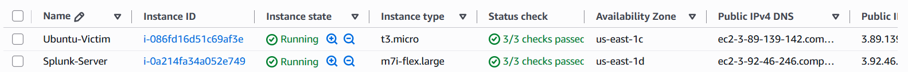
</p>

### AWS Security Groups

Network access was controlled using AWS security groups.

<p align="center">
  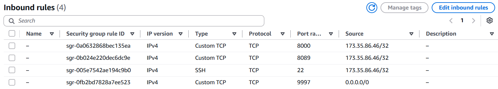
</p>

Required communication includes:

| Source | Destination | Port | Purpose |
|---|---|---:|---|
| Authorized Testing System | Ubuntu Target | 22 | SSH |
| Ubuntu Target | Splunk Enterprise | 9997 | Splunk Log Forwarding |
| Authorized Analyst | Splunk Enterprise | 8000 | Splunk Web |

### VPC Network

<p align="center">
  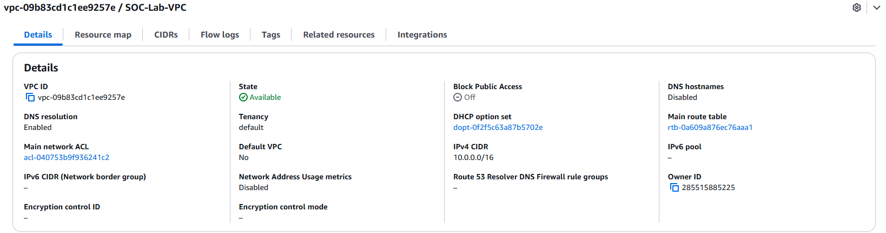
</p>

The cloud network provides connectivity between monitored systems while security groups restrict unnecessary access.

---

# 🔧 Splunk Configuration

Splunk Enterprise provides centralized security monitoring for the project.

### Splunk Enterprise Interface

<p align="center">
  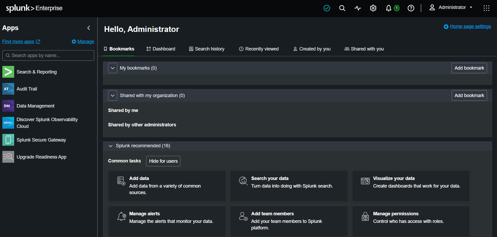
</p>

### Forwarder Receiving Port

Splunk Enterprise was configured to receive Universal Forwarder data over TCP port `9997`.

<p align="center">
  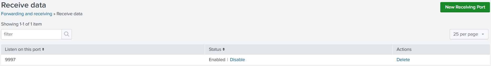
</p>

### Forwarder Status

Connectivity between the monitored Ubuntu endpoint and Splunk Enterprise was validated.

<p align="center">
  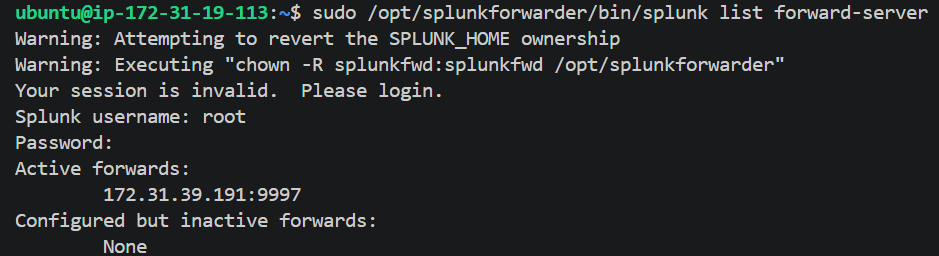
</p>

---

# 📥 Log Collection Pipeline

The primary authentication telemetry source is:

```text
/var/log/auth.log
```

The Universal Forwarder monitors this file continuously.

<p align="center">
  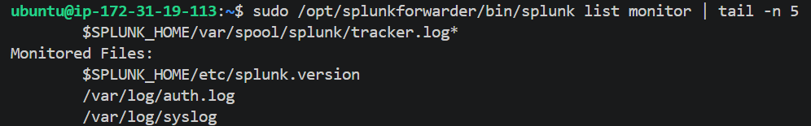
</p>

The complete ingestion pipeline is:

```text
SSH Event
    │
    ▼
OpenSSH
    │
    ▼
/var/log/auth.log
    │
    ▼
Splunk Universal Forwarder
    │
    │ TCP/9997
    ▼
Splunk Enterprise
    │
    ▼
linux_auth Index
```

### Authentication Events in Splunk

<p align="center">
  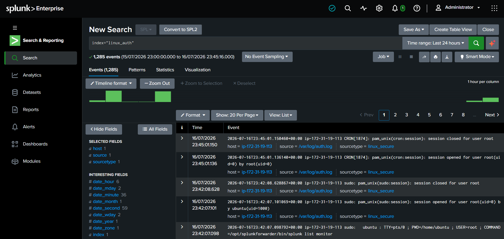
</p>

This confirms the successful end-to-end collection of Linux authentication telemetry.

---

# 🧪 Attack Simulation

Controlled security testing was performed to generate realistic authentication events.

## SSH Service Validation

Nmap was used within the authorized lab to verify that the target SSH service was reachable.

<p align="center">
  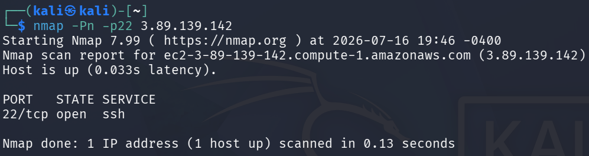
</p>

## Controlled Authentication Testing

Authentication activity was generated from the Kali Linux testing environment.

<p align="center">
  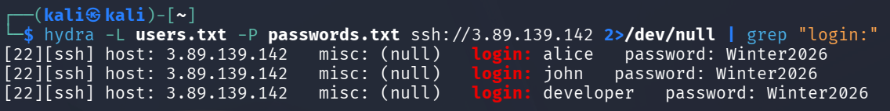
</p>

The generated events were then:

```text
Generated on Ubuntu
        ↓
Written to auth.log
        ↓
Forwarded to Splunk
        ↓
Indexed in linux_auth
        ↓
Analyzed with SPL
        ↓
Detected by Security Rules
```

> All testing was performed exclusively against authorized systems within the controlled lab environment.

---

# 🔎 Detection Engineering

The core technical focus of the project is transforming raw authentication events into actionable security detections.

The detection strategy focuses on:

- Failed SSH authentication activity
- Successful SSH authentication activity
- Authentication failure spikes
- Repeated failures from individual sources
- Frequently targeted user accounts
- Potential brute-force activity
- Successful authentication following repeated failures

Detection queries are version controlled in:

```text
spl/
```

This separates detection logic from documentation and allows rules to be independently maintained and improved.

---

# 🧠 Detection Catalog & Use Cases

## `DET-001` — Failed SSH Login Trend

```spl
index=linux_auth "Failed password"
| timechart count
```

**Purpose:** Identify changes and spikes in failed SSH authentication activity.

---

## `DET-002` — Successful SSH Login Trend

```spl
index=linux_auth "Accepted password"
| timechart count
```

**Purpose:** Monitor successful SSH authentication activity over time.

---

## `DET-003` — Top Attacking Source IPs

```spl
index=linux_auth "Failed password"
| rex "from (?<src_ip>\d+\.\d+\.\d+\.\d+)"
| stats count by src_ip
| sort -count
```

**Purpose:** Identify source IP addresses responsible for the highest volume of failed authentication attempts.

---

## `DET-004` — Most Targeted Users

```spl
index=linux_auth "Failed password"
| rex "for (invalid user )?(?<user>\w+)"
| stats count by user
| sort -count
```

**Purpose:** Identify user accounts receiving the highest number of authentication attempts.

---

## `DET-005` — SSH Brute-Force Detection

```spl
index=linux_auth "Failed password"
| rex "from (?<src_ip>\d+\.\d+\.\d+\.\d+)"
| stats count by src_ip
| where count >= 5
```

**Purpose:** Identify source IP addresses exceeding a predefined authentication failure threshold.

> Production detection thresholds should be tuned based on environment baselines and expected authentication behavior.

---

## `DET-006` — Successful Authentication After Multiple Failures

This detection correlates repeated authentication failures with subsequent successful authentication activity.

The complete validated SPL logic is maintained in:

```text
spl/
```

**Purpose:** Highlight authentication sequences that may warrant higher-priority investigation.

---

# 📊 SOC Monitoring Dashboard

The **Enterprise SSH Threat Monitoring Dashboard** provides centralized visibility into authentication activity.

<p align="center">
  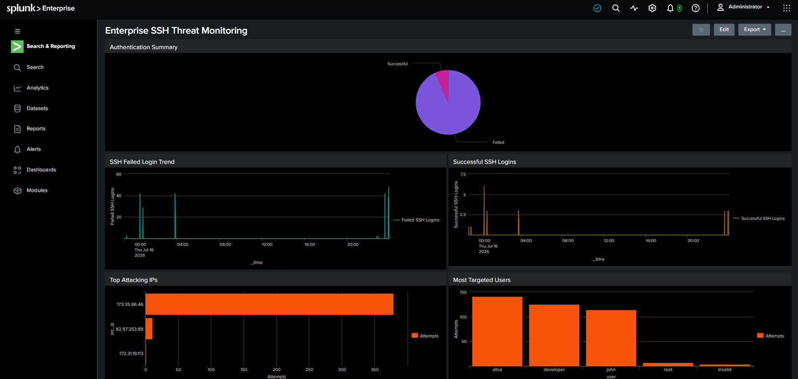
</p>

The dashboard includes:

- Failed SSH Login Trend
- Successful SSH Login Trend
- Top Attacking IP Addresses
- Most Targeted User Accounts
- SSH Brute-Force Detection
- Successful Login Correlation

---

## Brute-Force Detection Panel

<p align="center">
  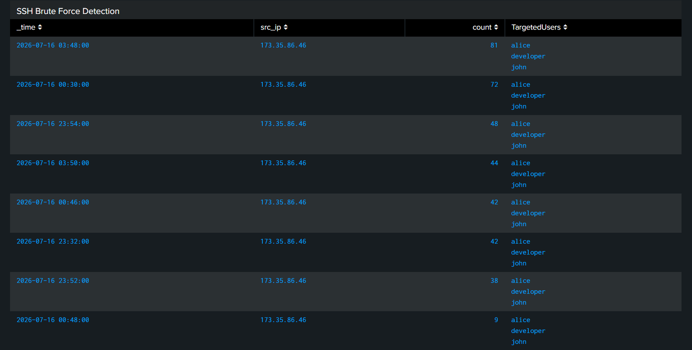
</p>

This panel highlights source IP addresses exceeding the configured authentication failure threshold.

---

## Successful Login Correlation

<p align="center">
  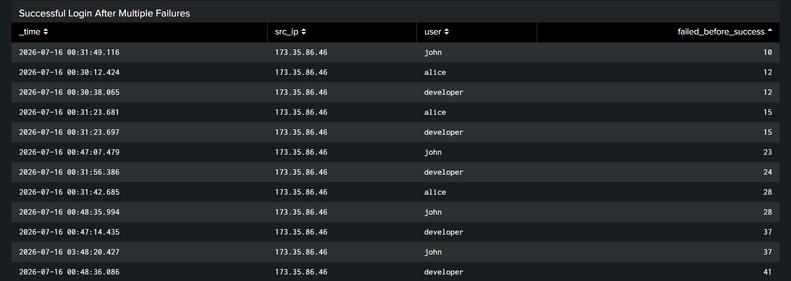
</p>

This detection helps analysts investigate successful authentication activity associated with previous failures.

---

## Authentication Login Trend

<p align="center">
  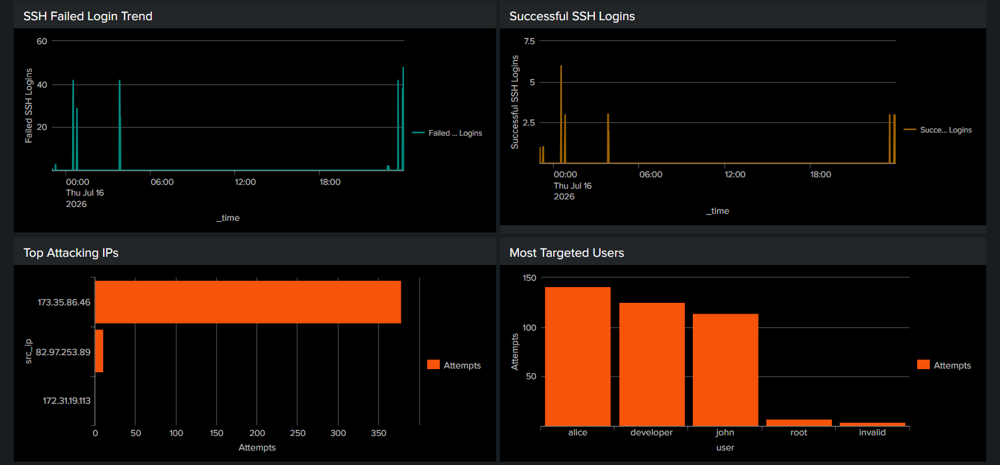
</p>

Authentication trends provide visibility into changes in login activity over time.

---

## Top Attacking IP

<p align="center">
  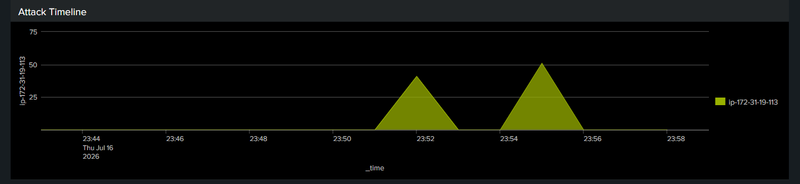
</p>

This visualization helps prioritize investigation of the most active suspicious sources.

---

# 🚨 Automated Alerting

The project implements scheduled Splunk alerting for potential SSH brute-force activity.

## Alert Configuration

<p align="center">
  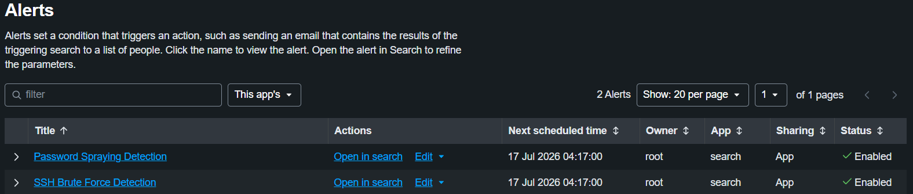
</p>

The alert periodically executes the detection search and evaluates whether suspicious activity exceeds the configured threshold.

---

## Alert Trigger History

<p align="center">
  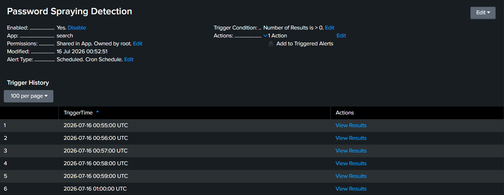
</p>

The trigger history confirms that the detection successfully generated alerts during controlled testing.

---

## Alert Results

<p align="center">
  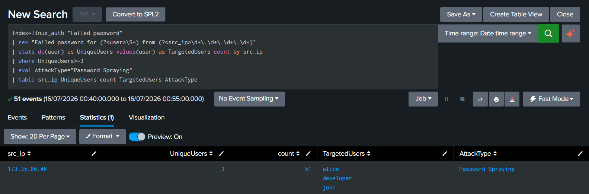
</p>

Alert results provide the analyst with the information required to begin investigation.

The alert workflow is:

```text
Authentication Events
        │
        ▼
Scheduled SPL Search
        │
        ▼
Detection Threshold
        │
        ▼
Suspicious Activity Found
        │
        ▼
Alert Triggered
        │
        ▼
SOC Analyst Investigation
```

---

# 🔬 Detection Query Validation

The brute-force detection logic was validated directly within Splunk Search.

### Query Validation — Part 1

<p align="center">
  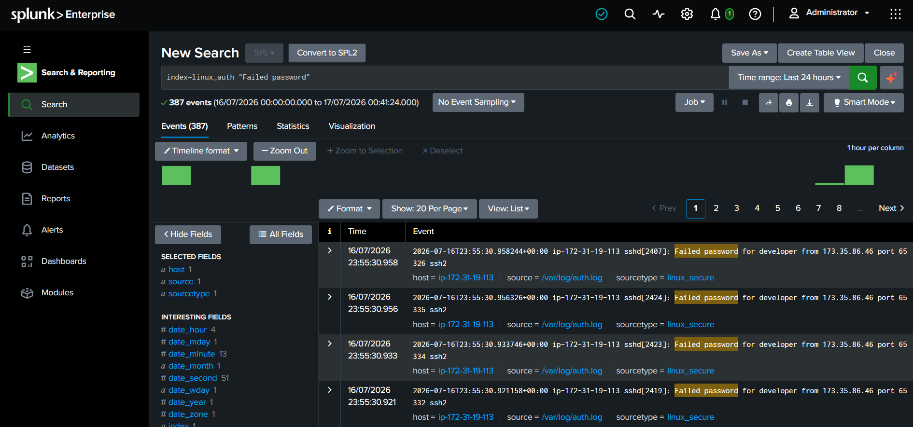
</p>

### Query Validation — Part 2

<p align="center">
  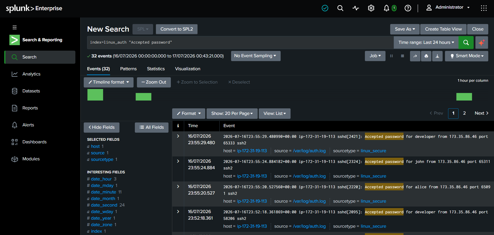
</p>

This validation confirms that the detection logic correctly identifies authentication activity matching the configured criteria.

---

# 🕵️ SOC Investigation Workflow

When suspicious authentication activity is detected, the analyst can follow this investigation process:

```text
Alert Triggered
      │
      ▼
Review Source IP
      │
      ▼
Identify Targeted Accounts
      │
      ▼
Review Authentication Timeline
      │
      ▼
Check for Successful Authentication
      │
      ▼
Review Related Security Events
      │
      ▼
Determine Severity
      │
      ▼
Escalate / Respond
```

A production response may include:

- Blocking a confirmed malicious source
- Protecting or disabling a compromised account
- Resetting credentials
- Reviewing endpoint activity
- Searching for additional indicators
- Escalating the incident

---

# 📸 Implementation Evidence

The project screenshots are organized by implementation stage:

```text
screenshots/
├── alerts/
├── architecture/
├── attacks/
├── aws/
├── dashboard/
└── splunk/
```

Together, these screenshots document the complete progression from infrastructure deployment to attack simulation, log collection, detection engineering, dashboard development, and automated alerting.

---

# 🗂️ Repository Structure

```text
Enterprise-SSH-Threat-Monitoring/
│
├── README.md
├── CHANGELOG.md
├── LICENSE
│
├── assets/
│
├── diagrams/
│   ├── architecture.drawio
│   └── architecture.png
│
├── docs/
│   ├── 01_Project_Overview.md
│   ├── 02_Lab_Architecture.md
│   ├── 03_AWS_Deployment.md
│   ├── 04_Splunk_Configuration.md
│   ├── 05_Log_Collection.md
│   ├── 06_Attack_Simulation.md
│   ├── 07_Detection_Engineering.md
│   ├── 08_Dashboard.md
│   ├── 09_Alerting.md
│   └── 10_Lessons_Learned.md
│
├── images/
│   ├── architecture.png
│   ├── banner.png
│   ├── dashboard-preview.png
│   └── workflow.png
│
├── screenshots/
│   ├── alerts/
│   │   ├── 16-alert-config.png
│   │   ├── 17-alert-triggered.png
│   │   └── 18-alert-results.png
│   │
│   ├── architecture/
│   │
│   ├── attacks/
│   │   └── 10-hydra.png
│   │
│   ├── aws/
│   │   ├── 01-ec2-instances.png
│   │   ├── 02-security-group.png
│   │   └── 03-vpc-network.png
│   │
│   ├── dashboard/
│   │   ├── 11-dashboard.png
│   │   ├── 12-bruteforce-table.png
│   │   ├── 13-success-correlation.png
│   │   ├── 14-login-trend.png
│   │   └── 15-top-attacking-ip.png
│   │
│   └── splunk/
│       ├── 04-splunk-home.png
│       ├── 05-forwarder-port.png
│       ├── 06-forwarder-status.png
│       ├── 07-monitor-authlog.png
│       ├── 08-linux-auth-events.png
│       ├── 09-nmap-scan.png
│       ├── 19.1-bruteforce-query.png
│       └── 19.2-bruteforce-query.png
│
├── scripts/
│
└── spl/
    └── Detection queries
```

---

# 📚 Documentation

Detailed technical documentation is available in the `docs/` directory.

| Document | Description |
|---|---|
| `01_Project_Overview.md` | Project objectives and scope |
| `02_Lab_Architecture.md` | Architecture and component design |
| `03_AWS_Deployment.md` | AWS infrastructure deployment |
| `04_Splunk_Configuration.md` | Splunk Enterprise configuration |
| `05_Log_Collection.md` | Authentication log collection pipeline |
| `06_Attack_Simulation.md` | Controlled security testing |
| `07_Detection_Engineering.md` | SPL detection development |
| `08_Dashboard.md` | SOC dashboard implementation |
| `09_Alerting.md` | Automated alerting workflow |
| `10_Lessons_Learned.md` | Challenges and technical lessons |

---

# 🏆 Key Outcomes

This project demonstrates more than SIEM deployment. It shows the ability to build and validate a complete defensive monitoring workflow:

- **Built** a cloud-hosted Splunk monitoring environment on AWS.
- **Centralized** Linux SSH authentication telemetry using the Splunk Universal Forwarder.
- **Developed** custom SPL detections for suspicious authentication behavior.
- **Validated** detection logic using controlled security testing and representative telemetry.
- **Operationalized** detections through dashboards and scheduled alerts.
- **Documented** the environment with architecture diagrams, implementation evidence, detection queries, and investigation workflows.

---

# 💡 Technical Skills Demonstrated

### Security Operations

- SOC Monitoring
- Security Event Analysis
- Alert Investigation
- Incident Triage
- Authentication Monitoring

### SIEM Engineering

- Splunk Enterprise
- Splunk Universal Forwarder
- Log Ingestion
- Index Management
- SPL
- Dashboard Development
- Alert Engineering

### Detection Engineering

- Detection Rule Development
- Authentication Analysis
- Threshold-Based Detection
- Detection Validation
- Event Correlation

### Cloud Security

- AWS EC2
- AWS VPC
- AWS Security Groups
- Cloud Networking

### Linux

- Ubuntu Administration
- OpenSSH
- Linux Authentication Logs
- Service Configuration
- Log Analysis

### Security Testing

- Kali Linux
- Nmap
- Controlled Authentication Testing
- Attack Simulation

### Engineering

- Git
- GitHub
- Technical Documentation
- Architecture Design
- Version Control

---

# 🧠 Engineering Lessons Learned

## Reliable Telemetry Comes First

Effective detection engineering depends on reliable security telemetry.

The complete data pipeline must function correctly:

```text
Log Source
    ↓
Universal Forwarder
    ↓
Network
    ↓
Splunk Receiver
    ↓
Index
    ↓
Detection
```

---

## Detection Rules Require Validation

A search returning results does not automatically make it a reliable detection.

Detection logic should be tested against representative security telemetry and reviewed for both false positives and false negatives.

---

## Dashboards Should Support Investigation

A useful SOC dashboard should help analysts answer specific security questions rather than simply displaying raw data.

---

## Alerts Require Tuning

Static thresholds are useful for demonstrating detection concepts, but production environments require tuning based on:

- Environment size
- Expected authentication volume
- User behavior
- Historical baselines
- Known administrative activity

---

# ✅ Version 1.0

Version 1.0 establishes the foundation of the Enterprise SSH Threat Monitoring project.

### Completed

- [x] AWS Infrastructure Deployment
- [x] Splunk Enterprise Deployment
- [x] Splunk Universal Forwarder Configuration
- [x] Linux Authentication Log Collection
- [x] SSH Security Monitoring
- [x] Controlled Attack Simulation
- [x] SPL Detection Engineering
- [x] SOC Dashboard
- [x] Scheduled Alerting
- [x] Alert Validation
- [x] Technical Documentation
- [x] Architecture Documentation
- [x] Screenshot Evidence
- [x] Version-Controlled Detection Queries

---

# 🛣️ Future Roadmap

## Version 2.0 — Advanced Detection Engineering

Planned improvements include:

- Password spraying detection
- Privilege escalation monitoring
- Suspicious `sudo` activity
- New user account monitoring
- SSH configuration change monitoring
- MITRE ATT&CK mapping
- Advanced authentication correlation

## Future Expansion

Potential future capabilities include:

- Threat intelligence enrichment
- IP reputation analysis
- Threat hunting dashboards
- Windows endpoint monitoring
- Sysmon telemetry
- Cross-platform detection engineering
- SOAR integration
- Automated incident response workflows

---

# 🔐 Security Considerations

This repository is intended for:

- Cybersecurity education
- Defensive security research
- Detection engineering
- Authorized security testing

All security testing documented in this project was performed within an authorized and controlled lab environment.

Sensitive information such as the following should never be committed to the repository:

- AWS credentials
- Private SSH keys
- API keys
- Access tokens
- Passwords
- Account identifiers

---

<p align="right"><a href="#-enterprise-ssh-threat-monitoring--detection-engineering-with-splunk">⬆ Back to top</a></p>

---

# 📄 License

This project is licensed under the **MIT License**.

See the `LICENSE` file for details.

---

# 👤 Author

## Ravi Kiran Kambhampati

**Cybersecurity | SOC Operations | Detection Engineering | Cloud Security**

This project was developed as part of a hands-on cybersecurity portfolio focused on practical experience in:

- Security Operations
- SIEM Engineering
- Detection Development
- Cloud Infrastructure
- Linux Security Monitoring
- Incident Investigation

---

<p align="center">
  <strong>🛡️ Enterprise SSH Threat Monitoring with Splunk</strong>
</p>

<p align="center">
  Authentication Telemetry → Detection Engineering → Alerting → Investigation
</p>

<p align="center">
  <strong>Version 1.0.0</strong>
</p>