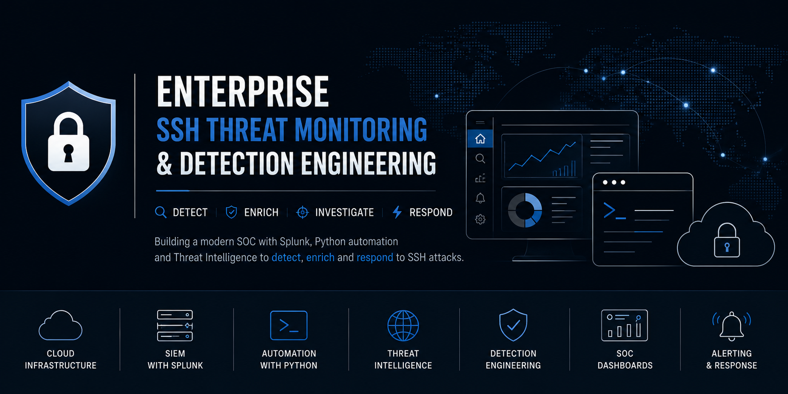
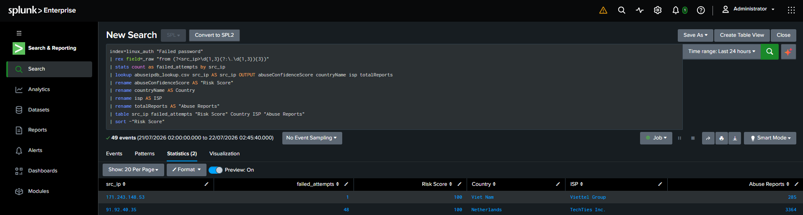
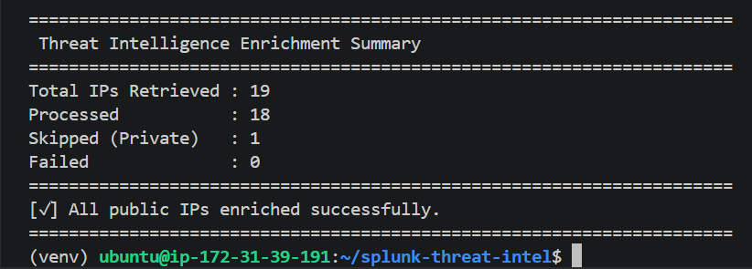

# 🛡️ Enterprise SSH Threat Monitoring & Detection Engineering with Splunk

<p align="center">
  
</p>

<p align="center">


</p>

<p align="center">

### Enterprise SOC Project | Splunk SIEM | Detection Engineering | Threat Intelligence | Python Automation

</p>

---

# 📖 Executive Overview

Security Operations Centers (SOCs) process millions of security events every day. Detecting malicious activity requires more than collecting logs—it demands correlation, enrichment, automation, and actionable intelligence.

This project demonstrates how a modern SOC can detect, investigate, and prioritize SSH authentication attacks using **Splunk Enterprise**, **Python automation**, and **Threat Intelligence enrichment** within an AWS-hosted lab environment.

The environment continuously collects Linux authentication logs from an Ubuntu server, forwards them into Splunk Enterprise, detects suspicious SSH activity using custom SPL analytics, enriches attacker IP addresses with AbuseIPDB reputation data, and presents investigation-ready dashboards for SOC analysts.

Rather than focusing solely on log collection, this repository emphasizes **Detection Engineering** by building custom analytics that transform raw authentication logs into meaningful security detections aligned with enterprise SOC workflows.

The project demonstrates:

- Centralized log collection
- Enterprise SIEM deployment
- Detection Engineering
- Threat Intelligence enrichment
- Python automation
- Splunk SDK integration
- MITRE ATT&CK mapping
- Automated lookup generation
- SOC dashboards
- Incident investigation workflow

The overall objective is to simulate how enterprise security teams identify, investigate, and prioritize SSH brute-force attacks while reducing manual analysis through automation.

---

# 🎯 Project Objectives

This project was designed to demonstrate practical Security Operations Center (SOC) skills that are commonly expected in Detection Engineering, Security Monitoring, and Blue Team roles.

Primary objectives include:

- Deploy enterprise infrastructure in AWS
- Configure Splunk Enterprise
- Deploy Splunk Universal Forwarder
- Collect Linux authentication logs
- Simulate SSH attacks from Kali Linux
- Develop custom SPL detections
- Detect brute-force attacks
- Detect password spraying
- Detect successful logins after multiple failures
- Identify targeted user accounts
- Enrich attacker IPs using Threat Intelligence
- Automate enrichment using Python
- Build investigation dashboards
- Generate scheduled alerts
- Map detections to MITRE ATT&CK
- Demonstrate an end-to-end SOC investigation workflow

---

# ⭐ Project Highlights

| Capability | Description |
|------------|-------------|
| ☁ AWS Infrastructure | Amazon EC2 deployment |
| 📊 SIEM | Splunk Enterprise |
| 📥 Log Collection | Splunk Universal Forwarder |
| 🔍 Detection Engineering | Custom SPL analytics |
| 🌍 Threat Intelligence | AbuseIPDB REST API |
| 🐍 Automation | Python + Splunk SDK |
| 📄 Lookup Tables | Automated CSV generation |
| 🚨 Alerting | Scheduled Splunk searches |
| 📈 Dashboards | SOC Investigation dashboards |
| 🛡 Framework | MITRE ATT&CK |

---

# 🏆 Key Features

## Security Monitoring

- Linux authentication monitoring
- SSH login monitoring
- Failed authentication detection
- Successful authentication detection
- Source IP tracking
- User account monitoring

---

## Detection Engineering

Custom SPL detections identify:

- SSH brute-force attacks
- Password spraying
- High-volume authentication failures
- Successful logins following repeated failures
- Targeted account attacks
- High-confidence malicious IP addresses
- Threat Intelligence matches

---

## Threat Intelligence

The project integrates external intelligence by:

- Querying AbuseIPDB
- Retrieving IP reputation
- Collecting abuse confidence scores
- Identifying ISP information
- Determining geolocation
- Recording historical abuse reports
- Enriching Splunk searches automatically

---

## Automation

Python automation performs:

- Splunk SDK searches
- IP extraction
- AbuseIPDB API requests
- JSON parsing
- Lookup generation
- CSV updates
- Error handling
- API validation

---

# 🛠 Technology Stack

| Category | Technology |
|-----------|------------|
| Cloud | AWS EC2 |
| Operating System | Ubuntu Server 24.04 |
| SIEM | Splunk Enterprise |
| Log Forwarding | Splunk Universal Forwarder |
| Attack Platform | Kali Linux |
| Language | Python 3 |
| Detection | SPL |
| Threat Intelligence | AbuseIPDB |
| API | REST |
| Automation | Splunk SDK |
| Framework | MITRE ATT&CK |
| Version Control | Git |
| Repository | GitHub |

---

# 📂 Project Structure

```text
splunk-threat-intel/
│
├── docs/
│   ├── architecture/
│   ├── dashboards/
│   ├── detections/
│   ├── setup/
│   └── screenshots/
│
├── images/
│
├── lookups/
│   └── abuseipdb_lookup.csv
│
├── scripts/
│   ├── abuseipdb.py
│   ├── lookup_builder.py
│   └── main.py
│
├── searches/
│
├── LICENSE
├── README.md
└── requirements.txt
```

---

# 📑 Table of Contents

1. Architecture
2. AWS Infrastructure
3. Splunk Enterprise
4. Universal Forwarder
5. Log Collection Pipeline
6. Attack Simulation
7. Detection Engineering
8. Detection Catalog
9. Threat Intelligence Integration
10. Python Automation
11. Lookup Generation
12. Dashboards
13. Alerting
14. Investigation Workflow
15. Repository Structure
16. Technical Skills
17. Lessons Learned
18. Roadmap
19. License
20. Author

---

# 🏗️ Solution Architecture

This project simulates a production-inspired Security Operations Center (SOC) monitoring pipeline that collects Linux authentication events, detects SSH-based attacks, enriches suspicious IP addresses with external threat intelligence, and provides actionable security insights through Splunk dashboards.

Rather than functioning as a simple log collection lab, the environment demonstrates how modern Detection Engineering combines telemetry, automation, and threat intelligence to improve incident detection and investigation.

The architecture consists of six major components:

- AWS Cloud Infrastructure
- Ubuntu Linux Endpoint
- Splunk Universal Forwarder
- Splunk Enterprise
- Python Automation Engine
- AbuseIPDB Threat Intelligence Platform

Together, these components create an automated workflow that transforms raw authentication logs into enriched security detections.

---

# 🖼️ Architecture Diagram

<p align="center">

```text
                    ┌────────────────────────────┐
                    │        Kali Linux          │
                    │  SSH Brute Force Attacks   │
                    └─────────────┬──────────────┘
                                  │
                                  ▼
                 ┌────────────────────────────────┐
                 │      Ubuntu Linux Server       │
                 │                                │
                 │  OpenSSH                       │
                 │  auth.log                      │
                 │  Authentication Events         │
                 └──────────────┬─────────────────┘
                                │
                                ▼
               ┌──────────────────────────────────┐
               │ Splunk Universal Forwarder (UF)  │
               │ Monitors auth.log                │
               │ Forwards Events                  │
               └──────────────┬───────────────────┘
                              │
                              ▼
              ┌───────────────────────────────────┐
              │      Splunk Enterprise SIEM       │
              │                                   │
              │ Indexing                          │
              │ Parsing                           │
              │ Searching                         │
              │ Detection Engineering             │
              │ Dashboards                        │
              │ Alerts                            │
              └──────────────┬────────────────────┘
                             │
                  Splunk SDK │
                             ▼
          ┌─────────────────────────────────────┐
          │     Python Automation Scripts       │
          │                                     │
          │ Extract Suspicious IP Addresses     │
          │ Query AbuseIPDB                     │
          │ Validate Responses                  │
          │ Generate CSV Lookup                 │
          └──────────────┬──────────────────────┘
                         │
                         ▼
            ┌─────────────────────────────┐
            │    AbuseIPDB REST API       │
            │                             │
            │ Reputation Score            │
            │ ISP                         │
            │ Country                     │
            │ Abuse Reports               │
            └─────────────┬───────────────┘
                          │
                          ▼
               Splunk Lookup Table (CSV)
                          │
                          ▼
              Detection Enrichment
                          │
                          ▼
             SOC Dashboards & Alerts
```

</p>

---

# 🔄 End-to-End Data Flow

The project follows a complete security monitoring lifecycle similar to enterprise Security Operations Centers.

---

<p align="center">

</p>

---


## Step 1 — Attack Simulation

Kali Linux performs SSH authentication attempts against the Ubuntu server.

These activities generate authentication events within:

```
/var/log/auth.log
```

Both legitimate and malicious authentication attempts are recorded.

---

## Step 2 — Log Collection

Splunk Universal Forwarder continuously monitors:

```
/var/log/auth.log
```

Every new authentication event is securely forwarded to Splunk Enterprise with minimal resource usage.

---

## Step 3 — Event Indexing

Splunk Enterprise receives incoming events and performs:

- Event parsing
- Timestamp extraction
- Host identification
- Source assignment
- Sourcetype classification
- Indexing

Once indexed, events become searchable using SPL.

---

## Step 4 — Detection Engineering

Custom SPL searches continuously analyze authentication events to identify suspicious behaviors, including:

- Excessive failed logins
- Brute-force attacks
- Password spraying
- Multiple targeted accounts
- Successful logins after repeated failures
- High-confidence malicious IP addresses

Instead of relying on built-in detections, each analytic was developed manually to demonstrate Detection Engineering skills.

---

## Step 5 — Threat Intelligence Automation

Python automation periodically:

- Executes Splunk searches
- Retrieves attacker IP addresses
- Removes duplicates
- Queries the AbuseIPDB REST API
- Parses JSON responses
- Validates API results
- Handles rate limits and connection errors
- Generates an updated CSV lookup

This process automatically enriches future Splunk searches with external reputation data.

---

## Step 6 — Threat Intelligence Correlation

Splunk correlates incoming authentication events with the generated lookup table.

Each event is enriched with valuable context including:

- Abuse Confidence Score
- Country
- ISP
- Domain
- Usage Type
- Number of Abuse Reports
- Last Reported Date

This enrichment enables analysts to prioritize investigations based on both event behavior and external reputation.

---

## Step 7 — SOC Investigation

Security analysts can investigate incidents directly within Splunk dashboards by reviewing:

- Source IP
- Username
- Number of failed attempts
- First observed activity
- Last observed activity
- Threat Intelligence score
- Country of origin
- ISP
- Historical abuse reports

This reduces manual lookups and accelerates incident response.

---

# ☁️ AWS Infrastructure

The entire lab is deployed inside Amazon Web Services (AWS) to simulate a cloud-hosted enterprise environment.

## Infrastructure Components

| Component | Purpose |
|----------|----------|
| Amazon EC2 | Hosts Ubuntu Server |
| Security Groups | Controls inbound SSH access |
| Elastic IP | Public accessibility |
| Ubuntu Server | Authentication target |
| Splunk Enterprise | Centralized SIEM |
| Splunk Universal Forwarder | Secure log forwarding |

---

## Why AWS?

AWS provides an ideal platform for cybersecurity labs because it offers:

- Cloud-native infrastructure
- Elastic scalability
- Secure networking
- Public accessibility for testing
- Easy deployment and management
- Real-world enterprise experience

Using AWS instead of local virtual machines more closely reflects modern enterprise environments.

---

# 📥 Splunk Universal Forwarder

The Splunk Universal Forwarder (UF) is responsible for collecting authentication logs from Ubuntu and forwarding them securely to Splunk Enterprise.

Its responsibilities include:

- Monitoring authentication logs
- Efficient log forwarding
- Reliable event delivery
- Minimal CPU usage
- Low memory consumption
- Secure communication

The Universal Forwarder acts as the telemetry collection layer of the SOC architecture.

---

# 📊 Splunk Enterprise

Splunk Enterprise serves as the central Security Information and Event Management (SIEM) platform.

Core responsibilities include:

- Event indexing
- Log normalization
- Search processing
- Detection Engineering
- Dashboard visualization
- Scheduled alerting
- Threat Intelligence correlation
- Investigation support

Every stage of the security monitoring lifecycle is performed within Splunk after logs have been collected.

---

# 📡 Log Collection Pipeline

```text
Ubuntu auth.log
        │
        ▼
Splunk Universal Forwarder
        │
        ▼
Splunk Enterprise
        │
        ▼
Index: linux_auth
        │
        ▼
Detection Searches
        │
        ▼
Threat Intelligence Enrichment
        │
        ▼
Dashboards
        │
        ▼
Alerts
        │
        ▼
SOC Investigation
```

---

# ⚔️ Attack Simulation

To validate the detection pipeline, controlled SSH attacks are launched from a Kali Linux system.

Attack scenarios include:

- SSH brute-force attacks
- Invalid username attempts
- Password spraying
- Multiple failed logins
- Successful login after repeated failures

These scenarios generate realistic authentication telemetry that exercises the custom SPL detections and validates the full monitoring workflow from event collection through investigation.

---

# 🎯 Detection Engineering

Detection Engineering is the core focus of this project.

Rather than relying on built-in Splunk detections, custom SPL analytics were developed to identify authentication anomalies, brute-force attacks, targeted account abuse, and malicious infrastructure.

Each detection was designed to reduce false positives while providing analysts with actionable security context.

The detections leverage:

- SPL (Search Processing Language)
- Statistical aggregation
- Event correlation
- Threshold-based detection
- Threat Intelligence enrichment
- MITRE ATT&CK mapping
- Dynamic severity classification

---

# 🛡️ Detection Catalog

| ID | Detection | MITRE Technique | Severity |
|----|-----------|----------------|----------|
| DET-001 | SSH Brute Force Detection | T1110 | High |
| DET-002 | Password Spraying Detection | T1110.003 | High |
| DET-003 | High Authentication Failure Volume | T1110 | Medium |
| DET-004 | Successful Login After Multiple Failures | T1110 | Critical |
| DET-005 | Targeted Account Detection | T1110 | Medium |
| DET-006 | Threat Intelligence Match | T1583 / T1584 | High |
| DET-007 | SSH Brute Force + Threat Intelligence Correlation | T1110 | Critical |

---

# 🚨 DET-001 — SSH Brute Force Detection

## Objective

Identify source IP addresses generating excessive failed SSH authentication attempts against one or more accounts.

## Detection Logic

- Monitor Linux authentication logs
- Count failed SSH logins
- Aggregate by source IP
- Trigger when failures exceed threshold

## MITRE ATT&CK

| Tactic | Technique |
|---------|-----------|
| Credential Access | T1110 - Brute Force |

## Severity

High

## Investigation Value

Analysts can quickly identify external hosts attempting credential attacks against Linux systems.

---

# 🚨 DET-002 — Password Spraying Detection

## Objective

Detect a single source IP attempting authentication against multiple user accounts using a limited number of passwords.

## Detection Logic

- Group failed logins by source IP
- Count unique usernames
- Alert when one IP targets multiple accounts

## MITRE ATT&CK

Credential Access — T1110.003 Password Spraying

## Severity

High

## Investigation Value

Password spraying attempts often evade traditional brute-force thresholds and are commonly observed in enterprise environments.

---

# 🚨 DET-003 — High Authentication Failure Volume

## Objective

Identify systems experiencing unusually large numbers of failed authentication events.

## Detection Logic

- Aggregate authentication failures
- Monitor authentication spikes
- Detect abnormal login activity

## MITRE ATT&CK

Credential Access — T1110

## Severity

Medium

## Investigation Value

Useful for identifying attack campaigns or operational issues affecting authentication services.

---

# 🚨 DET-004 — Successful Login After Multiple Failures

## Objective

Detect successful SSH logins that occur immediately after repeated failed authentication attempts.

## Detection Logic

- Track failed logins
- Identify subsequent successful login
- Correlate source IP and username

## MITRE ATT&CK

Credential Access — T1110

## Severity

Critical

## Investigation Value

A successful authentication following repeated failures may indicate compromised credentials.

Immediate analyst review is recommended.

---

# 🚨 DET-005 — Targeted Account Detection

## Objective

Identify user accounts receiving an abnormal number of authentication attempts.

## Detection Logic

- Aggregate by username
- Rank targeted accounts
- Identify repeated targeting

## MITRE ATT&CK

Credential Access — T1110

## Severity

Medium

## Investigation Value

Highlights privileged or high-value accounts that may require additional monitoring.

---

# 🚨 DET-006 — Threat Intelligence Match

## Objective

Identify authentication attempts originating from IP addresses with known malicious reputation.

## Detection Logic

- Extract source IP
- Perform lookup against AbuseIPDB
- Enrich events with reputation data
- Prioritize malicious infrastructure

## MITRE ATT&CK

Resource Development

## Severity

High

## Investigation Value

Threat Intelligence significantly reduces investigation time by immediately identifying known malicious infrastructure.

---

# 🚨 DET-007 — SSH Brute Force with Threat Intelligence Correlation

## Objective

Correlate brute-force authentication activity with external Threat Intelligence to identify high-confidence attacks.

This detection combines behavioral analytics with reputation scoring to reduce false positives and prioritize the highest-risk events.

## Detection Workflow

Authentication Events

↓

Extract Source IP

↓

Count Failed Logins

↓

Threat Intelligence Lookup

↓

MITRE ATT&CK Mapping

↓

Dynamic Severity Assignment

↓

SOC Alert

---

## Detection Criteria

An alert is generated when:

- Failed login count exceeds threshold
- Source IP exists within the Threat Intelligence lookup
- Abuse Confidence Score exceeds the configured threshold

---

## Dynamic Severity Model

| Conditions | Severity |
|------------|----------|
| Score ≥100 & Failures ≥200 | Critical |
| Score ≥100 & Failures ≥50 | High |
| Score ≥90 | Medium |
| Otherwise | Low |

---

## MITRE ATT&CK Mapping

| Category | Mapping |
|----------|---------|
| Tactic | Credential Access |
| Technique | T1110 - Brute Force |

---

## Analyst Context

Each alert includes:

- Source IP
- Failed Login Count
- Abuse Confidence Score
- Country
- ISP
- Domain
- Usage Type
- Number of Abuse Reports
- First Seen
- Last Seen
- Last Abuse Report

This enrichment allows analysts to prioritize investigations without manually querying external intelligence sources.

---

# 🌍 Threat Intelligence Integration

The project integrates the AbuseIPDB REST API to enrich authentication events with external reputation data.

For every suspicious source IP, the enrichment process retrieves:

- Abuse Confidence Score
- Country Code
- Country Name
- ISP
- Domain
- Usage Type
- Total Abuse Reports
- Last Reported Date

The resulting data is stored in a Splunk CSV lookup and automatically joined with authentication events during SPL searches.

This enables analysts to distinguish between generic authentication failures and attacks originating from infrastructure with a known history of malicious activity.

---

# 🐍 Python Automation

Manual threat intelligence enrichment is time-consuming and does not scale in modern Security Operations Centers (SOCs). To automate this process, a Python-based enrichment pipeline was developed that integrates Splunk Enterprise with the AbuseIPDB Threat Intelligence API.

Instead of manually exporting IP addresses and querying reputation services, the automation performs the entire workflow automatically.

The automation pipeline consists of three Python modules:

| Script | Purpose |
|----------|----------|
| `main.py` | Orchestrates the complete automation workflow |
| `abuseipdb.py` | Communicates with the AbuseIPDB REST API |
| `lookup_builder.py` | Generates Splunk CSV lookup tables |

---

# ⚙️ Automation Workflow

The automation performs the following sequence:

1. Execute a Splunk search using the Splunk SDK.
2. Retrieve unique source IP addresses from failed SSH authentication events.
3. Remove duplicate IP addresses.
4. Query the AbuseIPDB REST API for each IP.
5. Validate API responses.
6. Handle API errors, timeouts, and connection failures.
7. Parse JSON responses.
8. Generate an updated CSV lookup table.
9. Store the lookup in the Splunk lookup directory.
10. Enrich future SPL searches using the generated lookup.

This process transforms raw authentication telemetry into enriched security events without requiring analyst intervention.

---

# 🔌 Splunk SDK Integration

The project uses the Splunk Python SDK to interact directly with Splunk Enterprise.

SDK capabilities include:

- Executing SPL searches
- Retrieving search results
- Extracting suspicious source IPs
- Supporting automated workflows
- Eliminating manual exports

Using the SDK allows the enrichment pipeline to operate directly against live indexed data.

---

# 🌍 AbuseIPDB REST API

To enhance detections with external context, the project integrates the AbuseIPDB REST API.

For each suspicious IP address, the API returns:

- Abuse Confidence Score
- Country Code
- Country Name
- ISP
- Domain
- Usage Type
- Total Reports
- Last Reported Date

This information is later correlated with authentication events inside Splunk.

---

# 🛡️ Robust API Handling

The automation includes defensive programming practices to improve reliability.

Implemented safeguards include:

- HTTP status validation
- JSON validation
- Request timeouts
- Connection error handling
- HTTP exception handling
- Invalid response handling
- Missing field validation
- Graceful API failure handling
- Rate-limit awareness

These checks ensure the enrichment process continues operating even when external services encounter temporary issues.

---

# 📄 Automated Lookup Generation

After retrieving Threat Intelligence data, the automation generates a Splunk-compatible CSV lookup.

The lookup includes the following fields:

| Field | Description |
|--------|-------------|
| src_ip | Source IP address |
| abuseConfidenceScore | Abuse confidence rating |
| countryCode | Country code |
| countryName | Country name |
| isp | Internet Service Provider |
| domain | Associated domain |
| usageType | Network usage classification |
| totalReports | Number of abuse reports |
| lastReportedAt | Last reported abuse timestamp |

The generated lookup is consumed directly by Splunk searches using the `lookup` command, allowing events to be enriched in real time without repeated API calls.

---

# 📊 SOC Dashboards

To support analyst investigations, custom Splunk dashboards were created to visualize authentication activity and threat intelligence.

Dashboard panels include:

- Failed SSH authentication attempts
- Successful SSH logins
- Top attacking IP addresses
- Most targeted user accounts
- Authentication activity over time
- Threat Intelligence matches
- Abuse Confidence Score distribution
- Country of origin for attacker IPs
- High-severity detections

These dashboards provide analysts with immediate operational visibility into authentication events.

---

# 🚨 Scheduled Alerting

Splunk scheduled searches continuously evaluate authentication events against the custom detection logic.

Alerts are generated for:

- SSH brute-force activity
- Password spraying
- High authentication failure volumes
- Successful logins after repeated failures
- Threat Intelligence matches
- High-confidence malicious infrastructure

Alert severity is determined using the dynamic severity model implemented in DET-007.

---

# 🔍 SOC Investigation Workflow

The project follows a practical investigation workflow similar to those used in enterprise Security Operations Centers.

## Step 1 — Alert Generation

A scheduled SPL search identifies suspicious authentication behavior and generates an alert.

---

## Step 2 — Event Review

The analyst reviews:

- Source IP address
- Username
- Authentication status
- Number of failed attempts
- Event timestamps

---

## Step 3 — Threat Intelligence Enrichment

The source IP is automatically enriched using the generated AbuseIPDB lookup.

Additional context includes:

- Reputation score
- Country
- ISP
- Domain
- Usage type
- Historical abuse reports

---

## Step 4 — Risk Assessment

The analyst evaluates:

- Authentication behavior
- Threat Intelligence score
- Historical activity
- Attack volume
- User account targeting

---

## Step 5 — Investigation

Based on the available evidence, the analyst can:

- Prioritize the incident
- Investigate the affected account
- Review additional authentication events
- Search for related activity
- Escalate the incident if necessary

---

---

# 📷 Project Gallery

## Architecture

<p align="center">

</p>

---

## Splunk Dashboard

<p align="center">

</p>

---

## Threat Intelligence Enrichment

<p align="center">

</p>

---

## Python Automation

<p align="center">

</p>

---

## Generated Lookup

<p align="center">

</p>

---


# 📁 Repository Structure

The repository is organized to separate infrastructure, automation, detections, documentation, and supporting assets, making it easy to understand, maintain, and extend.

```text
splunk-threat-intel/
│
├── docs/
│   ├── architecture/
│   ├── dashboards/
│   ├── detections/
│   ├── setup/
│   └── screenshots/
│
├── images/
│   ├── architecture.png
│   ├── dashboard.png
│   ├── detection.png
│   └── banner.png
│
├── lookups/
│   └── abuseipdb_lookup.csv
│
├── scripts/
│   ├── abuseipdb.py
│   ├── lookup_builder.py
│   └── main.py
│
├── searches/
│   ├── DET-001.spl
│   ├── DET-002.spl
│   ├── DET-003.spl
│   ├── DET-004.spl
│   ├── DET-005.spl
│   ├── DET-006.spl
│   └── DET-007.spl
│
├── LICENSE
├── README.md
├── requirements.txt
└── .gitignore
```

---

# 📚 Documentation

The repository includes comprehensive documentation covering each stage of the project.

| Documentation | Description |
|--------------|-------------|
| Architecture | Solution design and data flow |
| AWS Deployment | Infrastructure setup |
| Splunk Installation | SIEM deployment and configuration |
| Universal Forwarder | Log forwarding configuration |
| Detection Engineering | SPL analytics and detection logic |
| Threat Intelligence | AbuseIPDB integration |
| Python Automation | Automation workflow and scripts |
| Dashboards | Splunk visualizations |
| Investigation Workflow | SOC analyst process |

---

# 💡 Lessons Learned

Building this project provided practical experience across multiple cybersecurity domains.

### Security Monitoring

- Designing centralized log collection pipelines
- Monitoring Linux authentication activity
- Understanding authentication telemetry
- Developing effective security monitoring workflows

### Detection Engineering

- Writing production-style SPL searches
- Building threshold-based detections
- Reducing false positives
- Correlating events across multiple data sources
- Applying MITRE ATT&CK mappings to detections

### Threat Intelligence

- Integrating external intelligence into SIEM workflows
- Working with REST APIs
- Enriching events with reputation data
- Improving analyst context and prioritization

### Python Automation

- Automating repetitive SOC tasks
- Parsing JSON responses
- Building reliable API integrations
- Implementing robust exception handling
- Generating Splunk-compatible lookup files

### Cloud Security

- Deploying workloads in AWS
- Configuring Ubuntu servers
- Managing SSH access
- Collecting and forwarding security logs
- Operating cloud-hosted monitoring infrastructure

---

# 🚀 Future Enhancements

The project provides a strong foundation that can be expanded with additional enterprise capabilities.

### Detection Engineering

- Geo-location anomaly detection
- Impossible travel detection
- Credential stuffing analytics
- User behavior analytics (UBA)
- Time-based anomaly detection

### Threat Intelligence

- VirusTotal integration
- AlienVault OTX integration
- GreyNoise integration
- MISP integration
- URLHaus integration

### Automation

- Scheduled enrichment jobs
- Automated IOC updates
- IOC expiration handling
- Multi-source intelligence correlation

### SOC Enhancements

- Risk-based alerting
- SOAR integration
- Case management
- Automated incident response
- Email and Slack notifications

### Infrastructure

- Multi-endpoint monitoring
- Windows event collection
- Sysmon integration
- Active Directory monitoring
- Container log monitoring

---

# 🏅 Skills Demonstrated

This project demonstrates practical experience with:

### SIEM & Security Monitoring

- Splunk Enterprise
- Search Processing Language (SPL)
- Log Collection
- Event Correlation
- Dashboard Development
- Scheduled Alerting

### Detection Engineering

- Custom Detection Development
- Authentication Monitoring
- SSH Brute Force Detection
- Password Spraying Detection
- MITRE ATT&CK Mapping
- Dynamic Severity Classification

### Threat Intelligence

- AbuseIPDB
- Threat Enrichment
- IOC Correlation
- Reputation Scoring
- REST API Integration

### Programming & Automation

- Python
- Splunk SDK
- JSON Processing
- CSV Generation
- Exception Handling
- Workflow Automation

### Cloud & Infrastructure

- Amazon Web Services (AWS)
- Ubuntu Linux
- Kali Linux
- Splunk Universal Forwarder
- Linux Administration
- SSH Monitoring

---

# 📈 Key Outcomes

By completing this project, the following capabilities were successfully demonstrated:

- End-to-end SIEM deployment
- Enterprise log collection
- Detection engineering using SPL
- Threat intelligence integration
- Python-based SOC automation
- Automated lookup generation
- MITRE ATT&CK-aligned detections
- Dynamic risk prioritization
- SOC dashboard development
- Investigation-ready security workflows

---

# 📄 License

This project is licensed under the **MIT License**.

You are welcome to use, modify, and distribute this project in accordance with the terms of the license.

---

# 👨‍💻 Author

## Ravi Kiran Kambhampati

**Cybersecurity & Cloud Operations Graduate**

Passionate about:

- Detection Engineering
- Security Operations (SOC)
- Threat Intelligence
- Cloud Security
- SIEM Engineering
- Incident Response
- Security Automation

### Connect

- LinkedIn: [www.linkedin.com/in/ravikirankambhampati](https://www.linkedin.com/in/ravikirankambhampati/)
- GitHub Repository:
- https://github.com/ravikirank29/Enterprise-SSH-Threat-Monitoring

---

# ⭐ Support the Project

If you found this repository useful or learned something from it:

- ⭐ Star the repository
- 🍴 Fork the project
- 💬 Share feedback
- 🛠️ Suggest improvements
- 🤝 Open pull requests

Your support helps improve the project and encourages continued development.

---

# 🙏 Acknowledgements

This project was inspired by real-world Security Operations Center (SOC) workflows and built as a hands-on portfolio project to strengthen skills in:

- Detection Engineering
- Threat Intelligence
- Security Monitoring
- SIEM Engineering
- Cloud Security
- Python Automation

Special thanks to the open-source community and the maintainers of Splunk, Python, and AbuseIPDB for providing the tools and resources that made this project possible.

---

<p align="center">

**Built with ❤️ for Blue Teaming, Detection Engineering, and Continuous Learning.**

</p>

