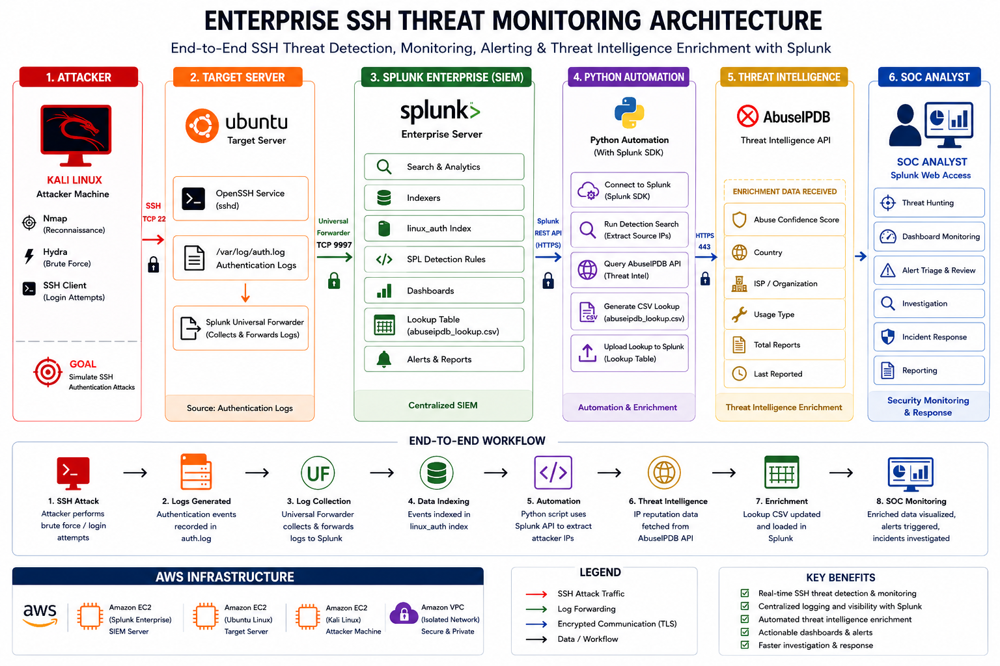

# 🛡️ Enterprise SSH Threat Monitoring & Detection Engineering with Splunk

<div align="center">

### 🔐 From Raw SSH Telemetry to Actionable SOC Detection

**A cloud-hosted detection engineering lab that simulates SSH authentication threats, centralizes Linux security telemetry, detects suspicious behavior, and operationalizes alerts for SOC investigation.**

<br>


<br>

**AWS EC2** · **Splunk Enterprise** · **Splunk Universal Forwarder** · **Ubuntu** · **Kali Linux** · **SPL** · **SOC Operations**

</div>

---

## 📖 Project Overview

Modern Security Operations Centers depend on reliable telemetry and well-engineered detections to identify suspicious behavior before it becomes a security incident.

**Enterprise SSH Threat Monitoring & Detection Engineering with Splunk** is an end-to-end SOC lab that demonstrates how Linux SSH authentication activity can be collected, centralized, analyzed, detected, visualized, and investigated using Splunk Enterprise.

The project recreates a practical security monitoring pipeline in AWS:

```text
ATTACK SIMULATION
      │
      ▼
SECURITY TELEMETRY
      │
      ▼
LOG COLLECTION
      │
      ▼
SIEM INGESTION
      │
      ▼
DETECTION ENGINEERING
      │
      ├──────────────┐
      ▼              ▼
  DASHBOARDS       ALERTS
      │              │
      └──────┬───────┘
             ▼
      SOC INVESTIGATION
```

Controlled authentication activity is generated against an Ubuntu SSH server. Authentication events written to `/var/log/auth.log` are collected by the Splunk Universal Forwarder and transmitted to Splunk Enterprise.

Custom SPL detections transform this raw telemetry into security use cases capable of identifying:

* Repeated SSH authentication failures
* Potential brute-force behavior
* High-volume suspicious source IPs
* Frequently targeted user accounts
* Successful SSH authentications
* Potential successful authentication following repeated failures

The project moves beyond simply installing a SIEM by demonstrating the complete **attack-to-detection lifecycle** used in security operations.

> [!IMPORTANT]
> All security testing and attack simulations documented in this repository were performed exclusively against systems owned and controlled within an authorized lab environment.

---

## 🎯 What This Project Demonstrates

<table>
<tr>
<td width="50%" valign="top">

### 🔍 Detection Engineering

* Custom SPL detection development
* SSH brute-force detection
* Authentication behavior analysis
* Threshold-based detection
* Security event correlation
* Detection validation

</td>
<td width="50%" valign="top">

### 🛡️ SOC Operations

* Centralized security monitoring
* Alert investigation
* Authentication analysis
* Incident triage
* Threat hunting
* Analyst investigation workflows

</td>
</tr>

<tr>
<td width="50%" valign="top">

### ☁️ Cloud Security

* AWS EC2 infrastructure
* VPC networking
* Security group configuration
* Cloud-hosted SIEM architecture
* Secure service communication

</td>
<td width="50%" valign="top">

### 📊 SIEM Engineering

* Splunk Enterprise
* Universal Forwarder
* Log ingestion pipelines
* Index management
* SPL analytics
* Dashboards and alerts

</td>
</tr>
</table>

---

## 🏗️ Architecture

<div align="center">



</div>

### Architecture at a Glance

```text
┌─────────────────────────┐
│      KALI LINUX         │
│   Security Testing      │
│                         │
│  • SSH Client           │
│  • Nmap                 │
│  • Controlled Testing   │
└────────────┬────────────┘
             │
             │ SSH Authentication Activity
             │ TCP/22
             ▼
┌─────────────────────────┐
│     UBUNTU SERVER       │
│   Monitored Endpoint    │
│                         │
│  • OpenSSH              │
│  • /var/log/auth.log    │
│  • Universal Forwarder  │
└────────────┬────────────┘
             │
             │ Security Telemetry
             │ TCP/9997
             ▼
┌─────────────────────────┐
│   SPLUNK ENTERPRISE     │
│   Centralized SIEM      │
│                         │
│  • linux_auth Index     │
│  • SPL Detections       │
│  • Dashboards           │
│  • Scheduled Alerts     │
└────────────┬────────────┘
             │
             │ Actionable Security Data
             ▼
┌─────────────────────────┐
│       SOC ANALYST       │
│                         │
│  • Monitor              │
│  • Investigate          │
│  • Triage               │
│  • Respond              │
└─────────────────────────┘
```

---

## 🔄 End-to-End Detection Pipeline

The lab follows the same fundamental telemetry lifecycle found in production security monitoring environments.

```text
┌──────────────────────────┐
│  1. ATTACK SIMULATION    │
│  Controlled SSH Testing  │
└─────────────┬────────────┘
              ▼
┌──────────────────────────┐
│  2. EVENT GENERATION     │
│  OpenSSH Authentication  │
└─────────────┬────────────┘
              ▼
┌──────────────────────────┐
│  3. LOG COLLECTION       │
│  /var/log/auth.log       │
└─────────────┬────────────┘
              ▼
┌──────────────────────────┐
│  4. LOG FORWARDING       │
│  Universal Forwarder     │
│  TCP/9997                │
└─────────────┬────────────┘
              ▼
┌──────────────────────────┐
│  5. SIEM INGESTION       │
│  Splunk → linux_auth     │
└─────────────┬────────────┘
              ▼
┌──────────────────────────┐
│  6. DETECTION            │
│  Custom SPL Analytics    │
└─────────────┬────────────┘
              ▼
       ┌──────┴──────┐
       ▼             ▼
┌────────────┐ ┌────────────┐
│ DASHBOARD  │ │   ALERT    │
└──────┬─────┘ └──────┬─────┘
       └───────┬───────┘
               ▼
┌──────────────────────────┐
│  7. SOC INVESTIGATION    │
│  Analyze → Triage        │
│  Investigate → Respond   │
└──────────────────────────┘
```

---

## 🧩 Lab Components

### 🔴 Kali Linux — Security Testing System

Kali Linux represents the offensive security component of the controlled environment.

It is used to generate authentication telemetry required to validate the detection pipeline.

**Primary functions:**

* SSH service reconnaissance
* Controlled authentication testing
* Failed login generation
* Detection validation

**Tools:**

`Nmap` · `SSH Client` · `Hydra`

---

### 🟠 Ubuntu — Monitored Endpoint

The Ubuntu EC2 instance represents a Linux server monitored by the SOC.

It runs the OpenSSH service and generates authentication events that become the primary telemetry source for the project.

```text
/var/log/auth.log
```

Events include:

* Failed authentication attempts
* Successful SSH authentications
* Invalid username attempts
* SSH daemon events
* Session creation
* Session termination

---

### 🟢 Splunk Universal Forwarder — Telemetry Collection

The Universal Forwarder provides continuous log collection from the monitored endpoint.

```text
/var/log/auth.log
        │
        ▼
┌───────────────────────┐
│ Universal Forwarder   │
└───────────┬───────────┘
            │
            │ TCP/9997
            ▼
┌───────────────────────┐
│  Splunk Enterprise    │
└───────────────────────┘
```

This creates a continuous pipeline between endpoint authentication activity and centralized security analytics.

---

### ⚫ Splunk Enterprise — SIEM & Detection Platform

Splunk Enterprise serves as the central security analytics platform.

Authentication telemetry is stored in the dedicated index:

```text
linux_auth
```

Splunk provides:

* Centralized log ingestion
* Security event indexing
* SPL-based detection logic
* Threat hunting capabilities
* SOC dashboards
* Scheduled alerting
* Investigation support

---

### 🔵 SOC Analyst — Investigation Layer

The analyst represents the human decision-making layer of the detection pipeline.

The workflow includes:

```text
Monitor
   ↓
Detect
   ↓
Validate
   ↓
Investigate
   ↓
Triage
   ↓
Respond
```

---

## 🛠️ Technology Stack

| Category              | Technology                 | Role                              |
| :-------------------- | :------------------------- | :-------------------------------- |
| ☁️ **Cloud**          | AWS EC2                    | Hosts the lab infrastructure      |
| 🛡️ **SIEM**          | Splunk Enterprise          | Centralized security analytics    |
| 📡 **Collection**     | Splunk Universal Forwarder | Endpoint log forwarding           |
| 🐧 **Endpoint**       | Ubuntu Linux               | Monitored SSH server              |
| 🔴 **Testing**        | Kali Linux                 | Controlled security testing       |
| 📄 **Telemetry**      | `/var/log/auth.log`        | Authentication event source       |
| 🔎 **Detection**      | SPL                        | Security analytics and detections |
| 🌐 **Protocol**       | SSH                        | Authentication service            |
| 🔬 **Reconnaissance** | Nmap                       | SSH service validation            |
| 📊 **Visualization**  | Splunk Dashboards          | SOC monitoring                    |
| 🚨 **Alerting**       | Splunk Alerts              | Automated detection notification  |
| ☁️ **Networking**     | AWS VPC / Security Groups  | Network segmentation and access   |

---

## 🚀 Implementation Journey

### Phase 01 — Build the Infrastructure

AWS EC2 instances were deployed to host the Splunk Enterprise SIEM and monitored Ubuntu endpoint.

AWS security groups were configured to control communication between components.

```text
Testing System ───── TCP/22 ─────► Ubuntu
Ubuntu ───────────── TCP/9997 ───► Splunk
SOC Analyst ──────── TCP/8000 ───► Splunk Web
```

---

### Phase 02 — Deploy the SIEM

Splunk Enterprise was configured as the centralized security monitoring platform.

A dedicated security index was created:

```text
linux_auth
```

The Splunk receiver was configured to accept forwarded telemetry on:

```text
TCP/9997
```

---

### Phase 03 — Connect the Endpoint

The Splunk Universal Forwarder was deployed to the Ubuntu server and configured to monitor:

```text
/var/log/auth.log
```

New authentication events are continuously forwarded to the SIEM.

---

### Phase 04 — Validate Telemetry

Before building detections, the ingestion pipeline was validated.

```spl
index=linux_auth
```

This confirmed the complete telemetry path:

```text
OpenSSH → auth.log → Universal Forwarder → Splunk → linux_auth
```

---

### Phase 05 — Generate Security Events

Controlled SSH authentication testing generated representative security telemetry, including:

* Repeated authentication failures
* Invalid username attempts
* Successful authentication
* High-volume authentication activity

---

### Phase 06 — Engineer Detections

Raw authentication logs were converted into actionable detections using custom SPL.

---

### Phase 07 — Build SOC Visibility

Detection results were integrated into a centralized Splunk dashboard to provide analyst visibility.

---

### Phase 08 — Operationalize Alerting

Scheduled Splunk alerts automatically evaluate authentication telemetry and surface suspicious activity requiring investigation.

---

# 🔎 Detection Engineering

The core of this project is transforming **raw Linux authentication logs into actionable security detections**.

Instead of relying only on individual events, the detection strategy analyzes authentication behavior across:

```text
WHO?
Targeted Username

WHERE FROM?
Source IP Address

WHAT?
Authentication Result

HOW OFTEN?
Attempt Frequency

WHEN?
Authentication Timeline
```

All detection logic is version controlled under:

```text
spl/
```

---

## 🧠 Detection Catalog

|     ID    | Detection              | Security Question                                 | Output                             |
| :-------: | :--------------------- | :------------------------------------------------ | :--------------------------------- |
| `DET-001` | Failed Login Trend     | Are authentication failures increasing?           | Time-based failure trend           |
| `DET-002` | Successful Login Trend | When are successful logins occurring?             | Authentication baseline            |
| `DET-003` | Top Source IPs         | Which sources generate the most failures?         | Ranked source IPs                  |
| `DET-004` | Targeted Users         | Which accounts are being targeted?                | Ranked usernames                   |
| `DET-005` | SSH Brute Force        | Which sources exceed failure thresholds?          | Suspicious source list             |
| `DET-006` | Success After Failures | Did repeated failures precede a successful login? | Correlated authentication activity |

---

### `DET-001` · Failed SSH Login Trend

**Objective:** Identify spikes or unusual increases in failed SSH authentication activity.

```spl
index=linux_auth "Failed password"
| timechart count
```

**Analyst value:** A sudden increase in failed authentication activity can indicate credential guessing or automated authentication attempts.

---

### `DET-002` · Successful SSH Login Trend

**Objective:** Establish visibility into successful SSH authentications.

```spl
index=linux_auth "Accepted password"
| timechart count
```

**Analyst value:** Monitoring successful authentication helps establish normal behavior and supports investigations involving potentially compromised accounts.

---

### `DET-003` · Top Authentication Failure Sources

**Objective:** Identify source IP addresses responsible for the highest volume of failed authentication attempts.

```spl
index=linux_auth "Failed password"
| rex "from (?<src_ip>\d+\.\d+\.\d+\.\d+)"
| stats count by src_ip
| sort -count
```

**Analyst value:** Prioritizes high-volume sources for investigation.

---

### `DET-004` · Most Targeted Accounts

**Objective:** Identify user accounts receiving the highest number of failed authentication attempts.

```spl
index=linux_auth "Failed password"
| rex "for (invalid user )?(?<user>\w+)"
| stats count by user
| sort -count
```

**Analyst value:** Highlights accounts that may be targeted during credential attacks.

---

### `DET-005` · Potential SSH Brute Force

**Objective:** Detect sources exceeding a predefined failed authentication threshold.

```spl
index=linux_auth "Failed password"
| rex "from (?<src_ip>\d+\.\d+\.\d+\.\d+)"
| stats count by src_ip
| where count >= 5
```

**Lab Threshold**

```text
≥ 5 Failed Authentication Attempts
```

> [!NOTE]
> This threshold is intentionally simple for lab validation. Production environments should incorporate defined time windows, behavioral baselines, allowlists, asset context, identity context, and environment-specific tuning.

---

### `DET-006` · Successful Authentication After Multiple Failures

**Objective:** Identify authentication patterns where repeated failures may be followed by successful access.

The validated correlation logic is maintained separately:

```text
spl/06_successful_after_failures.spl
```

**Analyst value:** A successful authentication following repeated failures may represent a higher-risk event requiring additional investigation.

---

# 📊 SOC Command Center

<div align="center">


**Enterprise SSH Threat Monitoring Dashboard**

</div>

The dashboard acts as the primary monitoring interface for the SOC analyst.

### Dashboard Visibility

| Panel                     | Analyst Question                                   |
| :------------------------ | :------------------------------------------------- |
| 📉 Failed SSH Login Trend | Is failed authentication activity increasing?      |
| 📈 Successful Login Trend | When are successful authentications occurring?     |
| 🌐 Top Source IPs         | Which sources generate the most failures?          |
| 👤 Most Targeted Users    | Which accounts are being targeted?                 |
| 🚨 Brute-Force Detection  | Which sources crossed the detection threshold?     |
| 🔐 Success After Failures | Did suspicious failures lead to successful access? |

### Investigation Pivot

```text
┌─────────────────────┐
│ Failed Login Spike  │
└──────────┬──────────┘
           ▼
┌─────────────────────┐
│ Identify Source IP  │
└──────────┬──────────┘
           ▼
┌─────────────────────┐
│ Identify User       │
└──────────┬──────────┘
           ▼
┌─────────────────────┐
│ Review Timeline     │
└──────────┬──────────┘
           ▼
┌─────────────────────┐
│ Successful Login?   │
└──────────┬──────────┘
           ▼
┌─────────────────────┐
│ Investigate & Triage│
└─────────────────────┘
```

---

# 🚨 Automated Detection & Alerting

The project demonstrates the transition from **passive monitoring** to **operational detection**.

```text
Authentication Telemetry
          │
          ▼
┌──────────────────────┐
│ Scheduled SPL Search │
└──────────┬───────────┘
           ▼
┌──────────────────────┐
│ Evaluate Threshold   │
└──────────┬───────────┘
           ▼
      Results Found?
        /       \
      NO         YES
      │           │
      ▼           ▼
 Continue      Trigger
Monitoring      Alert
                  │
                  ▼
          SOC Investigation
```

| Configuration   | Value           |
| :-------------- | :-------------- |
| **Alert Type**  | Scheduled       |
| **Detection**   | SSH Brute Force |
| **Trigger**     | Results > 0     |
| **Data Source** | `linux_auth`    |
| **Priority**    | High            |

---

# 🕵️ SOC Investigation Workflow

When a detection triggers, the investigation follows a structured process:

**1️⃣ Alert Validation**

Review the detection timestamp, source IP, event count, and trigger condition.

**2️⃣ Source Analysis**

Determine whether the source IP generated additional suspicious authentication activity.

**3️⃣ Account Analysis**

Identify which user accounts were targeted.

**4️⃣ Timeline Reconstruction**

Analyze authentication events before, during, and after the detection.

**5️⃣ Compromise Check**

Determine whether the suspicious activity was followed by successful authentication.

**6️⃣ Severity Assessment**

Evaluate available evidence and classify the activity.

**7️⃣ Response**

In a production environment, possible actions may include blocking malicious sources, securing affected accounts, resetting credentials, reviewing endpoint telemetry, or escalating the incident.

---

# 📸 Detection Evidence

## 🖥️ Linux Authentication Telemetry

<div align="center">


*Raw Linux authentication events successfully ingested into Splunk Enterprise.*

</div>

---

## 🚨 SSH Brute-Force Detection

<div align="center">


*Custom SPL analytics identifying authentication sources exceeding the configured detection threshold.*

</div>

---

## 🔐 Successful Login Investigation

<div align="center">


*Authentication correlation supporting investigation of successful access around repeated failures.*

</div>

---

## 🔔 Alert Trigger History

<div align="center">


*Scheduled Splunk detections automatically surfacing suspicious authentication behavior.*

</div>

---

# 🗂️ Repository Structure

```text
Enterprise-SSH-Threat-Monitoring/
│
├── 📄 README.md
├── 📄 LICENSE
├── 📄 CHANGELOG.md
├── 📄 .gitignore
│
├── 📚 docs/
│   ├── 01_Project_Overview.md
│   ├── 02_Lab_Architecture.md
│   ├── 03_AWS_Deployment.md
│   ├── 04_Splunk_Configuration.md
│   ├── 05_Log_Collection.md
│   ├── 06_Attack_Simulation.md
│   ├── 07_Detection_Engineering.md
│   ├── 08_Dashboard.md
│   ├── 09_Alerting.md
│   └── 10_Lessons_Learned.md
│
├── 🏗️ diagrams/
│   ├── architecture.drawio
│   ├── architecture.png
│   └── architecture.svg
│
├── 🔎 spl/
│   ├── 01_failed_login_trend.spl
│   ├── 02_successful_login_trend.spl
│   ├── 03_top_attacking_ips.spl
│   ├── 04_targeted_users.spl
│   ├── 05_brute_force_detection.spl
│   ├── 06_successful_after_failures.spl
│   ├── 07_authentication_statistics.spl
│   └── 08_recent_security_events.spl
│
├── 📸 screenshots/
│   ├── aws/
│   ├── splunk/
│   ├── attacks/
│   ├── dashboard/
│   └── alerts/
│
└── 🖼️ images/
```

---

# 💡 Key Engineering Lessons

### 01 · Telemetry Before Detection

A detection is only as reliable as the data feeding it.

The ingestion pipeline must first be validated end to end:

```text
Log Source
    ↓
Forwarder
    ↓
Network
    ↓
Receiver
    ↓
Index
    ↓
Search
    ↓
Detection
```

---

### 02 · A Search Is Not Automatically a Detection

A query returning results does not necessarily represent reliable detection logic.

Effective detections require:

* Representative test telemetry
* Threshold tuning
* False-positive analysis
* False-negative analysis
* Environmental context

---

### 03 · Detection Context Matters

A single failed login has limited investigative value.

Correlating multiple dimensions provides stronger context:

```text
Source IP + Username + Frequency + Result + Time
```

---

### 04 · Dashboards Should Answer Questions

A SOC dashboard should not exist simply to display charts.

Every panel should help an analyst make an investigation decision.

---

### 05 · Alerting Requires Tuning

Static thresholds provide a useful starting point for detection validation.

Production detections require baselines, allowlists, asset criticality, identity context, historical behavior, and environment-specific tuning.

---

# 🧰 Skills Demonstrated

`Splunk Enterprise` `SPL` `SIEM` `Detection Engineering` `SOC Operations` `AWS EC2` `Linux` `Ubuntu` `Kali Linux` `SSH` `Log Analysis` `Threat Hunting` `Incident Triage` `Dashboard Engineering` `Security Alerting` `Git` `GitHub`

---

# 🛣️ Project Roadmap

```text
                    ┌──────────────────────────┐
                    │       VERSION 1.0        │
                    │ SSH Threat Monitoring    │
                    │       COMPLETED ✅       │
                    └────────────┬─────────────┘
                                 │
                                 ▼
                    ┌──────────────────────────┐
                    │       VERSION 2.0        │
                    │ Advanced Linux Detection │
                    └────────────┬─────────────┘
                                 │
                                 ▼
                    ┌──────────────────────────┐
                    │       VERSION 3.0        │
                    │  Threat Intelligence     │
                    └────────────┬─────────────┘
                                 │
                                 ▼
                    ┌──────────────────────────┐
                    │       VERSION 4.0        │
                    │     Threat Hunting       │
                    └────────────┬─────────────┘
                                 │
                                 ▼
                    ┌──────────────────────────┐
                    │       VERSION 5.0        │
                    │  Expanded SOC Platform   │
                    └──────────────────────────┘
```

### ✅ Version 1.0 — Current

* AWS-hosted monitoring environment
* Splunk Enterprise deployment
* Universal Forwarder integration
* Linux authentication telemetry
* SSH threat monitoring
* Controlled attack simulation
* Custom SPL detections
* SOC dashboard
* Scheduled alerting
* Investigation workflow

### 🔜 Version 2.0 — Advanced Linux Detection

* Password spraying detection
* Suspicious `sudo` activity
* Privilege escalation monitoring
* New account creation monitoring
* SSH configuration change detection
* Advanced authentication correlation

### 🌐 Version 3.0 — Threat Intelligence

* IP reputation enrichment
* Threat intelligence feeds
* Suspicious source prioritization
* Automated enrichment workflows

### 🔍 Version 4.0 — Threat Hunting

* Dedicated hunting queries
* Authentication anomaly hunting
* Historical source analysis
* Behavioral baselining

### 🤖 Version 5.0 — Expanded SOC Platform

* Windows endpoint monitoring
* Sysmon telemetry
* Cross-platform detection engineering
* Additional security telemetry
* SOAR integration
* Automated incident response

---

# 🔐 Responsible Use

This repository is intended exclusively for:

* Cybersecurity education
* Defensive security research
* Detection engineering
* Authorized security testing
* SOC training

All attack simulations documented in this project were conducted against systems specifically configured and authorized for testing.

Never perform security testing against systems without explicit authorization.

Sensitive information including AWS credentials, private keys, passwords, access tokens, and account identifiers should never be committed to a public repository.

---

# 📄 License

This project is licensed under the **MIT License**.

See the `LICENSE` file for additional details.

---

# 👤 Author

<div align="center">

## Ravi Kiran Kambhampati

### Cybersecurity · SOC Operations · Detection Engineering · Cloud Security

This project is part of a hands-on cybersecurity portfolio focused on building practical experience in **SIEM engineering, security monitoring, detection development, cloud security, and SOC investigation workflows**.

<br>

---

### 🛡️ Enterprise SSH Threat Monitoring & Detection Engineering

**Authentication Telemetry → Detection → Alert → Investigation**

`Version 1.0`

</div>
